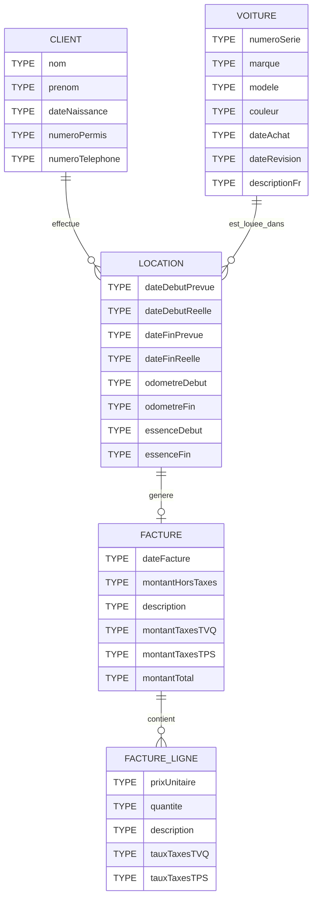

# TP2 - Location de voitures

## 1 - Directives

### 1.1 - Déroulement du TP

- Remise du travail: mercredi 1 juillet 2026, 23:59
- Ce travail est réalisé en équipe de 2 personnes et seuls les membres de cette équipe y contribuent
- Toutes les réponses fournies doivent être originales (produites par l’étudiant ou un membre de l’équipe)
- Toute copie de code, de portion de code, d’algorithme ou de texte doit faire mention de sa source
- L’emprunt ou la copie de code ou de portions de code est interdite
- Tout constat de plagiat, tricherie ou fraude sera automatiquement déclaré à la Direction et les sanctions prévues seront appliquées
- L'utilisation de l'IA et de toutes autres sources est considérée comme du plagiat si non documentée en tant que source (Si ce n'est pas dans votre cours, c'est qu'il faut une référence). Par exemple, si vous utilisez une requête trouvée sur StackOverflow, vous devez faire un commentaire dans votre code indiquant que vous avez utilisé cette requête et fournir un lien vers la source. Si vous utilisez une requête générée par une IA, vous devez faire un commentaire dans votre code indiquant que vous avez utilisé une IA pour générer cette requête et fournir le lien de partage de la discussion avec l'IA. 
- Toute source externe au matériel du cours doit être explicitement documentée ou sera considéré comme du plagiat
- Vous devez utiliser votre dépôt Git pour faire votre travail : si une situation particulière est détectée, vos commits moduleront votre note dans le groupe et peut même aller jusqu'à un zéro en cas de non participation. (Attention à l'utilisation de 4 mains sur un compte Git !)
- Durée : 3 x 3 heures + travail à la maison
- Plate forme : Microsoft SQL Server, .Net 8.0, Entity Framework, Visual Studio 2022, Git, GitHub, Léa
- Le sujet peut être mis à jour à cette adresse : https://github.com/PiFou86/420-W34-SF-TP02/blob/main/README.md

### 1.2 - À remettre sur la plateforme d'enseignement Léa

- Votre code source SQL dans le répertoire src/SQL sur Git
- Votre code source C# dans le répertoire src/CSharp sur Git
- Le contenu de ce répertoire zippé sur Léa avant la date indiquée

En résumé, vous devez simplement archiver le contenu de votre dépôt Git qui devrait contenir tous ces éléments au moment de la remise.

## 2 - Contexte

Vous devez créer une première version d'une base de données permettant de modéliser des locations de voitures pour la compagnie de location de voitures **VoiturePré.T.atine**.

Voici l'ERD qui vous a été fourni par votre analyste :

Votre analyste vous a indiqué quelques renseignements supplémentaires :

- Pour une voiture, la date de révision est la date de la dernière révision de la voiture : elle peut être nulle si aucune révision n'a été faite
- Une location a forcément un client et une voiture. La date de début et de fin de location prévue sont obligatoires. La date de début de location réelle et la date de fin de location réelle peuvent être nulles si la location n'est pas encore débutée ou n'est pas terminée
- Un client ne peut pas louer plus d'une voiture en même temps
- Les champs essenceDebut et essenceFin représentent une quantité en litres. Ils doivent donc être numériques.
- La facture est établie au retour de la voiture de location. La durée en jours de location est déterminée par la plus grande valeur obtenable avec la date de fin de location réelle ou la date de fin de location prévue moins la date de début de location réelle ou la date de début de location prévue
- Pour établir la facture :
  - La location est facturée à la journée : 60$ par jour
  - Frais d'essence : si la voiture est retournée avec moins d'essence que lors de la prise de possession : 3$ par litre + 50 $ de frais fixes
  - Il y a 40 litres d'essence dans la voiture lors de la prise de possession
  - Frais de nettoyage : 30$ par nettoyage (obligatoire pour toutes les locations de plus de 1 jour)
  - Taxes : TVQ 9.975% et TPS 5%
- Les tarifs doivent être configurables pour l'application. Par exemple, on devrait être capable de modifier facilement le tarif de location par jour, le tarif de l'essence, le tarif du nettoyage et les taxes avec une simple requête SQL (Vous faut-il une table pour cela ?) (5 points). La configuration doit au moins comporter :
    - TARIF_LOCATION_JOUR
    - TARIF_ESSENCE_LITRE
    - TARIF_ESSENCE_FRAIS_FIXE
    - TARIF_NETTOYAGE
    - TAUX_TPS
    - TAUX_TVQ

Dans ce TP, une location représente à la fois une réservation, une location en cours ou une location terminée. Son état est déterminé par les dates réelles :
- si dateDebutReelle est nulle, la location est prévue ;
- si dateDebutReelle est non nulle et dateFinReelle est nulle, la location est en cours ;
- si dateFinReelle est non nulle, la location est terminée.

## 3 - À réaliser

- Modifier le fichier `AUTHORS.md` (-10 points si non fait)
- Compléter l'ERD : types, PK, FK (5 points) - Équipier 1
- Écrire le script SQL permettant d'implanter l'ERD (20 points : clefs, contraintes, champs calculées, tables supplémentaires, etc.) - Équipier 2
- Créer des données de test (10 points) - Équipier 1
- Écrire les scripts SQL (un ou plusieurs fichiers dont le nom contient une numérotation indiquant l'ordre des scripts) suivantes (30 points) :
  - Créer une procédure permettant de renvoyer les voitures disponibles pour une période donnée (une période est définie par une date de début et une date de fin) (5 points) - Équipier 1
  - Créer une procédure permettant de renvoyer l'ensemble des voitures qui n'ont pas été louées depuis plus de 60 jours (5 points) - Équipier 2
  - Créer une procédure permettant de renvoyer les locations du jour courant, donc les prises de possession du jour (5 points) - Équipier 1
  - Créer une procédure permettant de renvoyer les locations revenants au jour courant, donc les retours prévus (5 points) - Équipier 2
  - Créer une procédure ou tout autre type de code SQL permettant de créer une facture pour une location terminée (10 points) - Équipier 1
- Créez une application console C# qui permet (35 points) : créez des classes partielles dont les fichiers sont préfixés par `Equipier1_` et `Equipier2_` pour les dépôts, couche métier, UI
  - Afficher les voitures à préparer ou à recevoir pour la journée courante (prises de possession / retours) (5 points) - Équipier 2
  - Créer une location (5 points) - Équipier 1
  - Créer une personne (5 points) - Équipier 2
  - Créer une voiture (5 points) - Équipier 1
  - Effectuer la prise de possession d'une voiture :  (5 points) - Équipier 2
  - Effectuer le retour d'une voiture (5 points) - Équipier 1
  - Afficher la facture pour une location (5 points) - Équipier 2
  - Afficher la configuration et effectuer des modifications de la configuration (5 points) - Équipier 1

Résumé des points :

| Points | Description |
|--------|-------------|
| 5 | Données de configuration de l'application |
| 20 | Implémentation de l'ERD |
| 10 | Données de test |
| 30 | Procédures |
| 40 | Application console C# |

## 4 - Exemples de factures

Ces exemples de factures ont été générés par ChatGPT avec le modèle GPT-4o.

### Exemple 1 - Location terminée avec plein d'essence

- Client : Jean Tremblay
- Voiture : Toyota Corolla (Date de révision : 2023-07-12)
- Date de prise de possession : 2024-09-15
- Date de retour prévue : 2024-09-17
- Date de retour réelle : 2024-09-17
- Niveau d'essence au retour : 40 litres (plein d'essence)
- Nettoyage nécessaire : Oui (location > 1 jour)

| Description                | Prix Unitaire| Quantité | Total HT       | Total TVQ      | Total TPS    | Total TTC   |
|----------------------------|--------------|----------|----------------|----------------|--------------|-------------|
| Location voiture           |     60.00 $  |    3     |     180.00 $   |     17.96 $    |     9.00 $   |   206.96 $  |
| Frais de nettoyage         |     30.00 $  |    1     |      30.00 $   |      2.99 $    |     1.50 $   |    34.49 $  |
|----------------------------|--------------|----------|----------------|----------------|--------------|-------------|
| Total                      |              |          |                |                |              |   241.45 $  |

### Exemple 2 - Location terminée avec carburant manquant

- Client : Marie Dubois
- Voiture : Honda Civic (Date de révision : 2024-08-05)
- Date de prise de possession : 2024-09-20
- Date de retour prévue : 2024-09-23
- Date de retour réelle : 2024-09-23
- Niveau d'essence au retour : 30 litres (10 litres manquants)
- Nettoyage nécessaire : Oui (location > 1 jour)

| Description                | Prix Unitaire| Quantité | Total HT       | Total TVQ      | Total TPS    | Total TTC   |
|----------------------------|--------------|----------|----------------|----------------|--------------|-------------|
| Location voiture           |     60.00 $  |    4     |     240.00 $   |     23.94 $    |    12.00 $   |   275.94 $  |
| Frais de nettoyage         |     30.00 $  |    1     |      30.00 $   |      2.99 $    |     1.50 $   |    34.49 $  |
| Frais d'essence            |      3.00 $  |   10     |      30.00 $   |      2.99 $    |     1.50 $   |    34.49 $  |
| Frais fixes essence        |     50.00 $  |    1     |      50.00 $   |      4.99 $    |     2.50 $   |    57.49 $  |
|----------------------------|--------------|----------|----------------|----------------|--------------|-------------|
| Total                      |              |          |                |                |              |   402.41 $  |

### Exemple 3 - Location prolongée avec carburant manquant
- Client : Pierre Leblanc
- Voiture : Ford Escape (Date de révision : 2024-09-01)
- Date de prise de possession : 2024-09-10
- Date de retour prévue : 2024-09-12
- Date de retour réelle : 2024-09-15 (location prolongée de 3 jours)
- Niveau d'essence au retour : 20 litres (20 litres manquants)
- Nettoyage nécessaire : Oui (location > 1 jour)

| Description                | Prix Unitaire| Quantité | Total HT       | Total TVQ      | Total TPS    | Total TTC   |
|----------------------------|--------------|----------|----------------|----------------|--------------|-------------|
| Location voiture           |     60.00 $  |    6     |     360.00 $   |     35.91 $    |    18.00 $   |   413.91 $  |
| Frais de nettoyage         |     30.00 $  |    1     |      30.00 $   |      2.99 $    |     1.50 $   |    34.49 $  |
| Frais d'essence            |      3.00 $  |   20     |      60.00 $   |      5.99 $    |     3.00 $   |    68.99 $  |
| Frais fixes essence        |     50.00 $  |    1     |      50.00 $   |      4.99 $    |     2.50 $   |    57.49 $  |
|----------------------------|--------------|----------|----------------|----------------|--------------|-------------|
| Total                      |              |          |                |                |              |   574.88 $  |

## 5 - Contraintes

- N'oubliez pas de respecter les nomenclatures demandées en cours
- Optimisez vos requêtes
- Partage entre équipier de code avec Git
- Remise complète finale sur Léa
- L'évaluation tient compte :
  - du style et de la structure du code : elle doit être similaire à celle proposée en cours (Découpage en couches, fichiers SQL idempotents) 
  - des pratiques de programmation apprises dans le programme doivent être appliquées

Tout partage de code, d'explication, de bouts de texte, etc. est considéré comme du plagiat. Pour plus de détails, consultez le site (et ses vidéos) [Sois intègre du Cégep de Sainte-Foy](http://csfoy.ca/soisintegre) ainsi que [l'article 6.1.12 de la PÉA](https://www.csfoy.ca/fileadmin/documents/notre_cegep/politiques_et_reglements/5.9_PolitiqueEvaluationApprentissages_2019.pdf)
