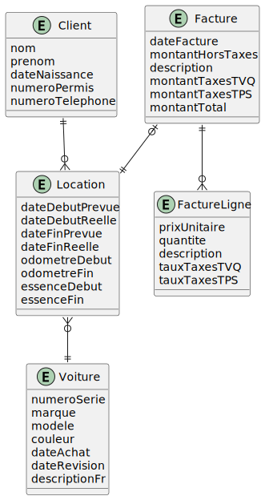

# TP2 - Réservation de voiture

## 1 - Directives

### 1.1 - Déroulement du TP

- Remise du travail: 15 février 2023, 23:59
- Ce travail est réalisé en équipe de 2 personnes et seuls les membres de cette équipe y contribuent
- Toutes les réponses fournies doivent être originales (produites par l’étudiant ou un membre de l’équipe)
- Toute copie de code, de portion de code, d’algorithme ou de texte doit faire mention de sa source
- L’emprunt ou la copie de code ou de portions de code est interdite
- Tout constat de plagiat, tricherie ou fraude sera automatiquement déclaré à la Direction et les sanctions prévues seront appliquées
- Vous devez utiliser votre dépôt Git pour faire votre travail : si une situation particulière est détectée, vos commits moduleront votre note dans le groupe et peut même aller jusqu'à un zéro en cas de non participation. (Attention à l'utilisation de 4 mains sur un compte Git !)
- Durée : 4 x 3 heures + travail à la maison
- Plate forme : SQL Server, .Net 6.0, Entity Framework, Visual Studio 2022, Git, GitHub, Léa
- Le sujet peut être mis à jour à cette adresse : https://github.com/PiFou86/420-W34-SF-TP02/blob/main/README.md

### 1.2 - À remettre sur la plateforme d'enseignement Léa

- Votre code source SQL dans le répertoire src/SQL sur Git
- Votre code source C# dans le répertoire src/CSharp sur Git
- Le contenu de ce répertoire zippé sur Léa avant la date indiquée

En résumé, vous pouvez simplement archiver le contenu de votre dépôt Git qui devrait contenir tous ces éléments au moment de la remise.

## 2 - Contexte

Vous devez créer une première version d'une base de données permettant de modéliser des locations de voitures pour la compagnie de location de voitures **VoiturePré.T.atine**.

Voici l'ERD qui vous a été fourni par votre analyste :

Votre analyste vous a indiqué quelques renseignements supplémentaires :

- Pour une voiture, la date de révision est la date de la dernière révision de la voiture : elle peut être nulle si aucune révision n'a été faite
- Une location a forcément un client et une voiture. La date de début et de fin de location prévue sont obligatoires. La date de début de location réelle et la date de fin de location réelle peuvent être nulles si la location n'est pas encore débutée ou n'est pas terminée
- Un client ne peut pas louer plus d'une voiture en même temps
- La facture est établie au retour de la voiture de location. La durée en jours de location est déterminée par la plus grande valeur obtenable avec la date de fin de location réelle ou la date de fin de location prévue moins la date de début de location réelle ou la date de début de location prévue
- Pour établir la facture :
  - La location est facturée à la journée : 60$ par jour
  - Frais d'essence : si la voiture est retournée avec moins d'essence que lors de la prise de possession : 3$ par litre + 50 $ de frais fixes
  - Il y a 40 litres d'essence dans la voiture lors de la prise de possession
  - Frais de nettoyage : 30$ par nettoyage (obligatoire pour toutes les locations de plus de 1 jour)
  - Taxes : TVQ 9.975% et TPS 5%
- Les tarifs doivent être configurables pour l'application. Par exemple, on devrait être capable de modifier facilement le tarif de location par jour, le tarif de l'essence, le tarif du nettoyage et les taxes avec une simple requête SQL (Vous faut-il une table pour cela ?) (5 points) : il n'est pas demandé de créer une interface utilisateur pour cela.

## 3 - À réaliser

- Modifier le fichier `AUTHORS.md` (-10 points si non fait)
- Écrire le script SQL permettant d'implanter l'ERD (20 points : clefs, contraintes, champs calculées, tables supplémentaires, etc.)
- Créer des données de test (10 points)
- Écrire les scripts suivantes (30 points) :
  - Créer une procédure permettant de renvoyer les voitures disponibles pour une période donnée (une période est définie par une date de début et une date de fin) (5 points)
  - Créer une procédure permettant de renvoyer l'ensemble des voitures qui n'ont pas été louées depuis plus de 60 jours (5 points)
  - Créer une procédure permettant de renvoyer les locations du jour courant, donc les prises de possession du jour (5 points)
  - Créer une procédure permettant de renvoyer les locations revenants au jour courant, donc les retours prévus (5 points)
  - Créer une procédure ou tout autre type de code SQL permettant de créer une facture pour une location terminée (10 points)
- Créez une application console C# qui permet (35 points):
  - Afficher les voitures à préparer ou à recevoir pour la journée courante (prises de possession / retours) (5 points)
  - Créer une location (5 points)
  - Créer une personne (5 points)
  - Créer une voiture (5 points)
  - Effectuer la prise de possession d'une voiture :  (5 points)
  - Effectuer le retour d'une voiture (5 points)
  - Affiche la facture pour une location (5 points)

Résumé des points :

| Points | Description |
|--------|-------------|
| 5 | Données de configuration de l'application |
| 20 | Implémentation de l'ERD |
| 10 | Données de test |
| 30 | Procédures |
| 35 | Application console C# |

## 4 - Contraintes

- N'oubliez pas de respecter les nomenclatures demandées en cours
- Optimisez vos requêtes
- Partage entre équipier de code avec Git
- Remise complète finale sur Léa

Tout partage de code, d'explication, de bouts de texte, etc. est considéré comme du plagiat. Pour plus de détails, consultez le site (et ses vidéos) [Sois intègre du Cégep de Sainte-Foy](http://csfoy.ca/soisintegre) ainsi que [l'article 6.1.12 de la PÉA](https://www.csfoy.ca/fileadmin/documents/notre_cegep/politiques_et_reglements/5.9_PolitiqueEvaluationApprentissages_2019.pdf)
